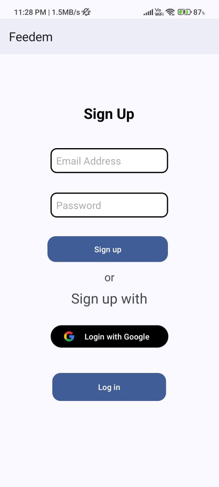
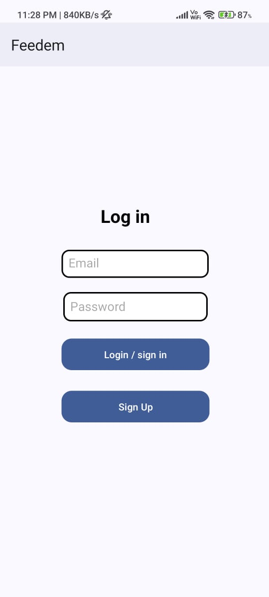
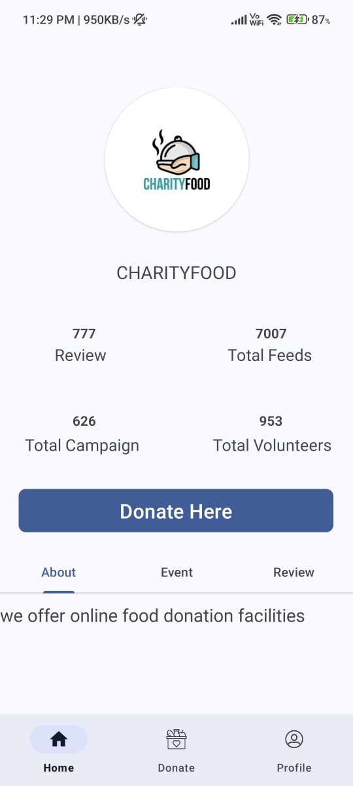
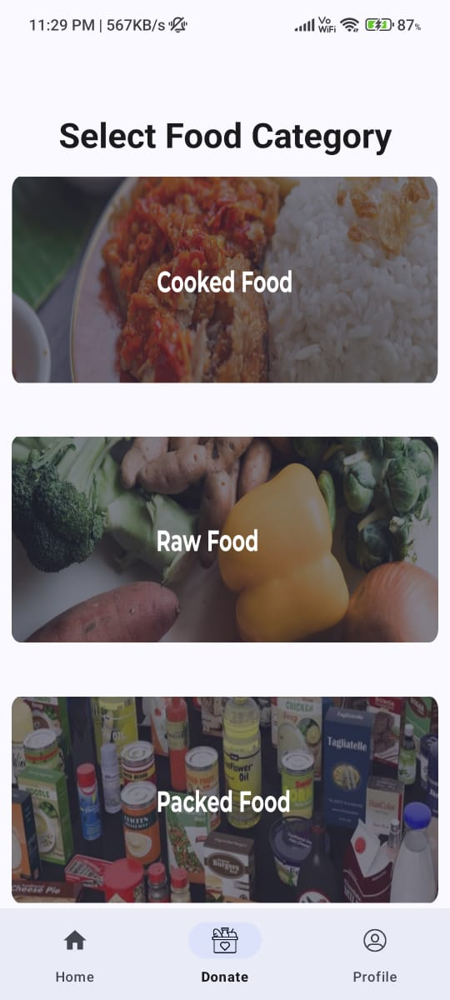
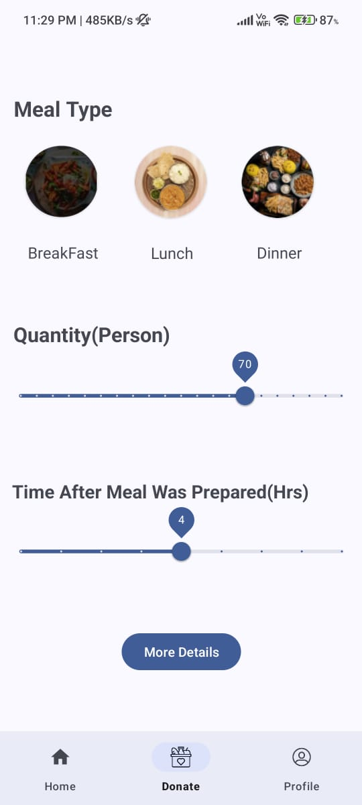
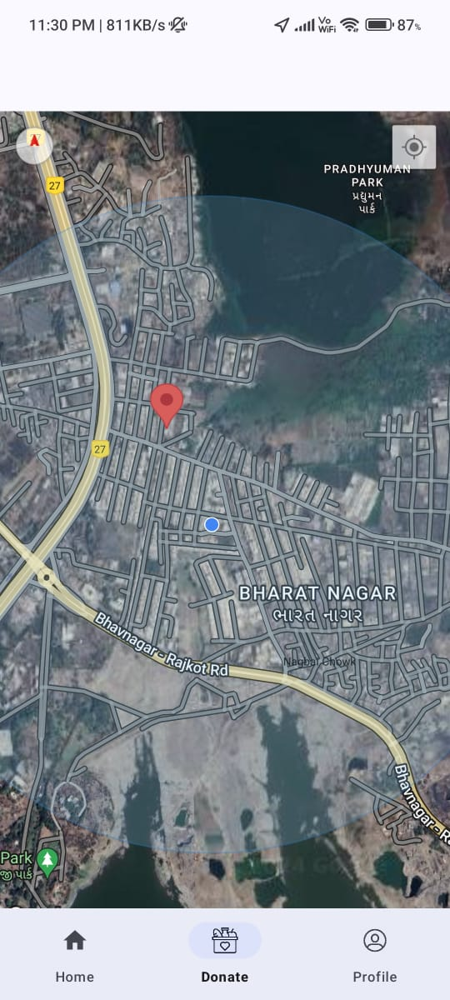
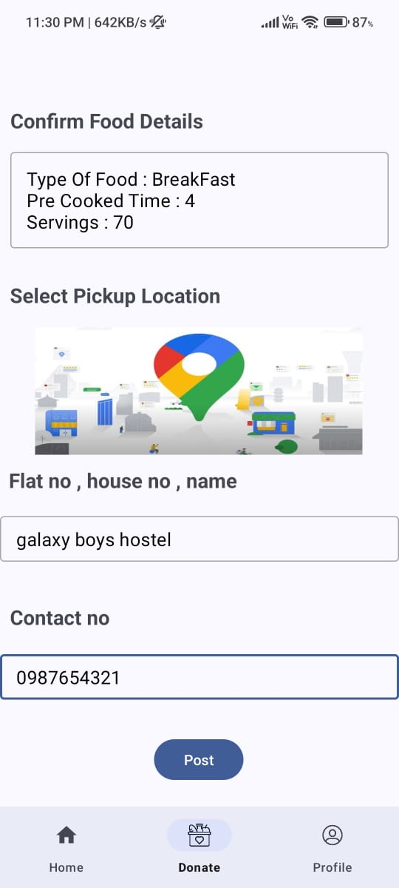
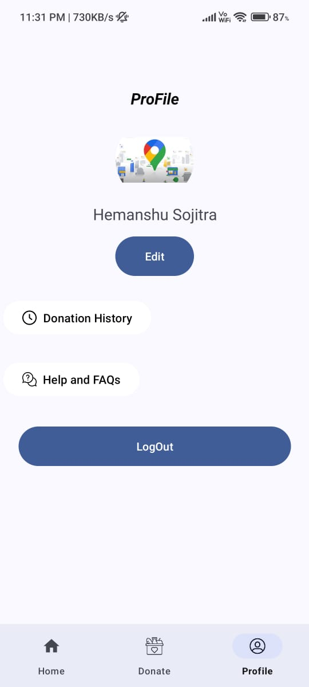
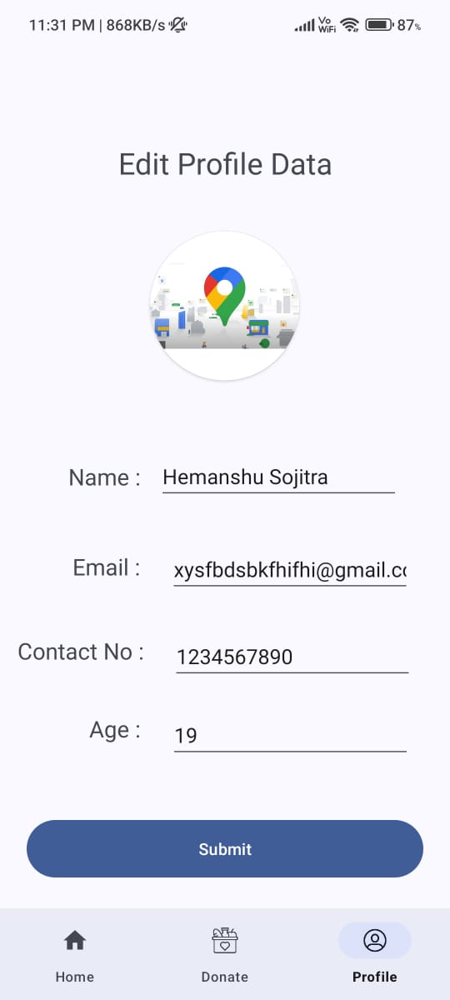

<div align="center">


<br/><br/>

# 🍱 Feedem

### *Let's Feed Those That Need It The Most*

**Feedem** is a fully functional Android food donation app that bridges the gap between food donors and NGOs. Anyone with leftover food can place a pickup request in minutes — the NGO dispatches a delivery person, food is packaged, and distributed to those in need.

> 🎓 Diploma Engineering Final Year Project — Government Polytechnic Rajkot, GTU 2023–24
> 
> 🌍 Domain: **Social Impact / Food Waste Reduction**

<br/>

[🚀 Getting Started](#-getting-started) • [✨ Features](#-features) • [📸 Screenshots](#-screenshots) • [🛠️ Tech Stack](#%EF%B8%8F-tech-stack) • [🗄️ Database](#%EF%B8%8F-database-design) • [👥 Team](#-team)

</div>

---

## 💡 The Problem We Solve

> **Food waste is a massive global problem.** Leftover food from events, restaurants, and homes often ends up in the garbage — while millions go hungry.

Feedem solves this by making food donation **as easy as placing an online order**:

- No need to physically deliver food to an NGO
- Just fill in a few details, drop a pin, and a pickup agent comes to you
- Track your donation status live from the app
- Earn reward points to encourage more social contributions

---

## ✨ Features

| Feature | Description |
|---|---|
| 🔐 **Authentication** | Email/Password signup & login + Google Sign-In via Firebase Auth |
| 🏠 **NGO Home Page** | View NGO details, stats (feeds, campaigns, volunteers), events & reviews |
| 🍽️ **Food Category Selection** | Choose between Cooked Food, Raw Food, or Packed Food |
| 🥗 **Meal Type Picker** | Select Breakfast, Lunch, or Dinner with visual food cards |
| 📊 **Quantity Slider** | Set number of servings and hours since meal was prepared |
| 📍 **Google Maps Pickup** | Drop a red pin on an interactive map to set your exact pickup location |
| ✅ **Donation Confirmation** | Review all details (food type, servings, time, address, contact) before posting |
| 👤 **Profile Management** | Upload photo, edit name/email/contact/age, view donation history |
| 📜 **Donation History** | Full log of all past donations with status tracking |
| 🔔 **Live Status Updates** | Real-time Firebase sync for donation request status |
| 🎨 **Dynamic Color Theme** | Auto color theme based on your device wallpaper (Material You) |
| ⚙️ **Background Services** | Data prefetched via Android Services for instant load times |

---

## 📸 Screenshots

<div align="center">

### 🔐 Authentication

<table>
  <tr>
    <td align="center"><b>Sign Up</b></td>
    <td align="center"><b>Log In</b></td>
  </tr>
  <tr>
    <td></td>
    <td></td>
  </tr>
</table>

---

### 🏠 Home & Donation Flow

<table>
  <tr>
    <td align="center"><b>🏠 NGO Home</b></td>
    <td align="center"><b>🍱 Food Category</b></td>
    <td align="center"><b>🥗 Meal Type & Qty</b></td>
  </tr>
  <tr>
    <td></td>
    <td></td>
    <td></td>
  </tr>
</table>

<table>
  <tr>
    <td align="center"><b>📍 Select Pickup Location</b></td>
    <td align="center"><b>✅ Confirm & Post Donation</b></td>
  </tr>
  <tr>
    <td></td>
    <td></td>
  </tr>
</table>

---

### 👤 Profile

<table>
  <tr>
    <td align="center"><b>My Profile</b></td>
    <td align="center"><b>Edit Profile</b></td>
  </tr>
  <tr>
    <td></td>
    <td></td>
  </tr>
</table>

</div>

---

## 🛠️ Tech Stack

```
├── Language        →  Java (100%)
├── Platform        →  Android (API 28 / Android 9.0+)
├── UI              →  XML Layouts + Material Design Components
├── Architecture    →  MVC with Bottom Navigation + Fragment Navigation
├── Maps            →  Google Maps API (Interactive pickup location selection)
├── Database        →  Firebase Realtime Database
├── Authentication  →  Firebase Auth (Email/Password + Google Sign-In)
├── Storage         →  Firebase Storage (User profile images)
├── Services        →  Android Background Services (data prefetch)
├── Build System    →  Gradle (Kotlin DSL)
└── IDE             →  Android Studio
```

**Key Firebase Collections:**
- 🔑 **Authentication** — Firebase Auth for secure user identity
- 📦 **Donation Data** — pickup requests, food type, quantity, location, status
- 👤 **Profile Data** — user name, email, contact, age, profile image
- 🏢 **NGO Details** — org name, logo, stats, about, events
- ⭐ **Reviews** — user reviews of the NGO
- 📅 **Events** — NGO campaigns and upcoming events

---

## 🗄️ Database Design

```
Firebase Realtime Database
│
├── users/
│   └── {uid}/
│       ├── name, email, contact, age
│       └── profileImageUrl
│
├── donations/
│   └── {donationId}/
│       ├── uid, foodType, category
│       ├── mealType, servings, preparedHoursAgo
│       ├── address, contactNo
│       ├── latitude, longitude
│       └── status (pending / picked / distributed)
│
├── ngo/
│   └── details, events, reviews, stats
│
└── Firebase Storage/
    └── profile_images/{uid}.jpg
```

---

## 📁 Project Structure

```
Feedem-A_Food_Donation_App/
│
├── app/
│   └── src/main/
│       ├── java/com/example/feedem/
│       │   ├── MainActivity.java          # Entry point, splash + navigation
│       │   ├── ui/
│       │   │   ├── Credentials_chacking/  # Login & Signup activities
│       │   │   ├── home/                  # NGO home fragment
│       │   │   ├── donate/                # Food category → type → map → confirm
│       │   │   └── profile/              # Profile view, edit, history
│       │   ├── ModelClasses/              # Donation_Data, User, NGO models
│       │   └── Service/                   # Background data fetching services
│       │       ├── MyService.java
│       │       └── Profile_retrival.java
│       ├── res/
│       │   ├── layout/                    # XML UI layouts
│       │   ├── navigation/                # mobile_navigation.xml
│       │   └── menu/                      # bottom_nav_menu.xml
│       └── AndroidManifest.xml
│
├── build.gradle.kts
└── settings.gradle.kts
```

---

## 🚀 Getting Started

### Prerequisites

- ✅ Android Studio (Electric Eel or later)
- ✅ JDK 11+
- ✅ Android device / emulator running **Android 9.0+**
- ✅ A Firebase project
- ✅ Google Maps API key

### Installation

**1. Clone the repository**
```bash
git clone https://github.com/Hemanshu4949/Feedem-A_Food_Donation_App.git
cd Feedem-A_Food_Donation_App
```

**2. Firebase setup**
- Create a project at [console.firebase.google.com](https://console.firebase.google.com)
- Enable **Realtime Database**, **Authentication** (Email + Google), and **Storage**
- Download `google-services.json` → place in `app/`

**3. Add your Google Maps API key**

In `app/src/main/AndroidManifest.xml`:
```xml
<meta-data
    android:name="com.google.android.geo.API_KEY"
    android:value="YOUR_GOOGLE_MAPS_API_KEY"/>
```

**4. Set Firebase Realtime Database rules**
```json
{
  "rules": {
    ".read": "auth != null",
    ".write": "auth != null"
  }
}
```

**5. Sync Gradle & Run**
```
Sync Gradle → Run on device or emulator
```

### Required Permissions

```xml
<uses-permission android:name="android.permission.INTERNET"/>
<uses-permission android:name="android.permission.READ_EXTERNAL_STORAGE"/>
<uses-permission android:name="android.permission.ACCESS_FINE_LOCATION"/>
<uses-permission android:name="android.permission.RECEIVE_BOOT_COMPLETED"/>
```

---

## 🔄 How Donation Works

```
1️⃣  User opens app → Logs in or signs up
         ↓
2️⃣  Home screen → Tap "Donate Here"
         ↓
3️⃣  Select Food Category → Cooked / Raw / Packed
         ↓
4️⃣  Select Meal Type → Breakfast / Lunch / Dinner
         ↓
5️⃣  Set Quantity (servings) & Time since prepared (hours)
         ↓
6️⃣  Drop red pin on Google Maps → Set pickup location
         ↓
7️⃣  Enter address details & contact number
         ↓
8️⃣  Tap "Post" → Request saved to Firebase
         ↓
9️⃣  NGO dispatches pickup agent → Status updates live
         ↓
🎉  Food delivered to those in need • Points awarded to donor
```

---

## 🧪 Testing

| Test Case | Description | Status |
|---|---|---|
| User Sign Up | Email registration + Google OAuth | ✅ Pass |
| User Login | Email login + redirect to home | ✅ Pass |
| NGO Home | Load NGO data from Firebase | ✅ Pass |
| Food Donation | Select category → type → map → post | ✅ Pass |
| Profile Edit | Update name, email, contact, age | ✅ Pass |
| Donation History | View past donations from Firebase | ✅ Pass |
| Logout | Clear session & redirect to login | ✅ Pass |

---

## 🔮 Future Enhancements

- 💾 **Cache layer** — pre-load Firebase data for faster startup
- 🔔 **Push notifications** — alert donors when pickup status changes
- 🏆 **Rewards system** — gamified points and leaderboard for donors
- 🤝 **Social features** — connect donors with other donors and NGOs
- 👕 **Multi-category donations** — expand beyond food to clothes, toys, essentials
- 🌐 **Multi-NGO support** — partner with multiple organizations
- 📊 **Impact dashboard** — visualize total meals donated by the community

---

## 🤝 Contributing

```bash
git checkout -b feature/your-feature-name
git commit -m "Add: your feature description"
git push origin feature/your-feature-name
# Open a Pull Request 🎉
```

---

## 👥 Team

| Name | Enrollment No. | Role |
|---|---|---|
| **Hemanshu Sojitra** | 216200316025 | Developer |
| **Rahul Chudasama** | 216200316020 | Developer |
| **Jay Solanki** | 216200316026 | Developer |

**Project Guide:** Ms. Khyati Kalaria
**Head of Department:** Ms. Madhvi Vasa
**Institution:** Government Polytechnic Rajkot — IT Department, GTU 2023–24

---

<div align="center">

⭐ If Feedem inspired you, give it a star!

*Built with ❤️ and Java for a hunger-free world.*

`Java` · `Android` · `Firebase` · `Google Maps` · `Material Design`

</div>
